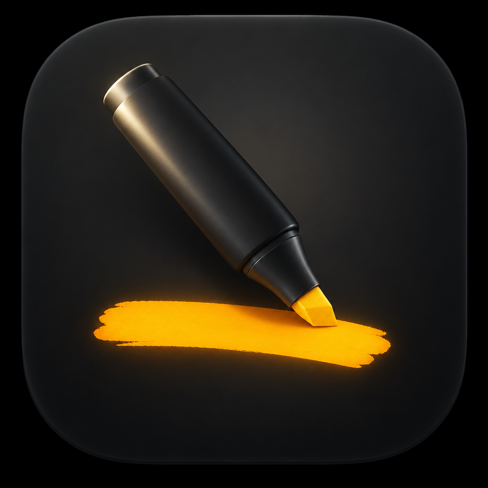

<p align="center">
  
</p>

# MarkIt

Highlight text on your Mac and it’s already on the clipboard. No ⌘C. Paste wherever you need it next.

MarkIt also keeps a searchable history (⌘⇧V), lets you pin clips you reuse, and skips apps you’d rather leave alone.

macOS 13+. Native Swift / AppKit. Not on the Mac App Store — highlight-to-copy needs Accessibility and a global event tap, which the sandbox doesn’t allow.

* [Features](#features)
* [Install](#install)
* [Usage](#usage)
* [Privacy](#privacy)
* [Free and Pro](#free-and-pro)
* [FAQ](#faq)
* [Build](#build)
* [Why](#why)
* [License](#license)

## Features

* Select text → it’s copied
* Menu bar history with search and pins
* Ignore apps; skip concealed pasteboard types (password managers stay out by default)
* Copy sound off, or pick a built-in macOS sound
* MIT

## Install

No notarized build yet. From this repo:

```sh
./scripts/build-debug-app.sh
open /Applications/MarkIt.app
```

Then turn MarkIt on under **System Settings → Privacy & Security → Accessibility**. Use the copy in `/Applications` — permission follows the signed binary, not the display name.

When releases exist: [GitHub Releases](https://github.com/RaulCPena/markit/releases) and [bigbeardapps.com/markit](https://bigbeardapps.com/markit/).

## Usage

1. Allow Accessibility. Highlight text in any app — MarkIt copies it.
2. ⌘⇧V opens history (or menu bar → Clipboard History). Type to filter. Click or Enter to paste.
3. Pin what you want to keep. Clear History drops the rest.
4. **Excluded Apps…** turns auto-copy off for specific apps. Finder and password managers are ignored by default.
5. **Copy Sound** → Off, or Purr / Pop / Blow / Tink / Glass / Funk.
6. Uncheck **Auto-copy on Select** if you only want history from normal copies.

## Privacy

History lives in a JSON file under Application Support. No MarkIt account. No MarkIt server. Concealed and transient pasteboard types are not stored.

## Free and Pro

Free aims to match what [Maccy](https://maccy.app) already gives away on GitHub — full local history, not a tiny free tier. Highlight-to-copy stays free.

Pro (planned, $9.99 once) is for extras beyond that: images/files, named clip sets, preserve-clipboard paste, paste stack. Notes: [docs/free-vs-pro.md](docs/free-vs-pro.md).

## FAQ

### Why Accessibility?

MarkIt has to see that you selected text in another app. A history-only manager can watch the pasteboard; this can’t.

### Why not the App Store?

Same reason. Event taps and cross-process Accessibility don’t fit the sandbox. Ship path is a Developer ID download from this repo.

### It copied when I clicked or opened a file.

That was a bug (tiny mouse moves and empty selections). Current builds need a real drag and skip empty text. If Accessibility still points at an old MarkIt, remove it and add `/Applications/MarkIt.app` again.

### Sound?

Off unless you choose one in the menu.

## Build

Swift Package. Open `Package.swift` in Xcode, or:

```sh
swift test
swift build
```

`scripts/build-debug-app.sh` builds a debug `.app` into `/Applications`. `scripts/release.sh` signs and notarizes (needs your Developer ID identity).

## Why

[Maccy](https://github.com/p0deje/Maccy) already nails clipboard history. MarkIt is the same idea plus one habit: selecting text should be enough. Free history should feel as generous as Maccy’s open-source app; the wedge is highlight-to-copy.

## License

[MIT](LICENSE)
